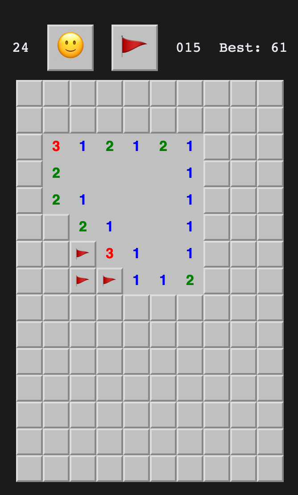

# Sh*tty Minesweeper

A proof of concept of a Minesweeper game written in React.

- 📱 mobile friendly
- 📏💣 customizable bomb amount and board size
- 🏆 saves high score on Local Storage
- 📝 separates high scores per board configuration

[Play](https://rachel-carvalho.github.io/shitty-minesweeper/)

